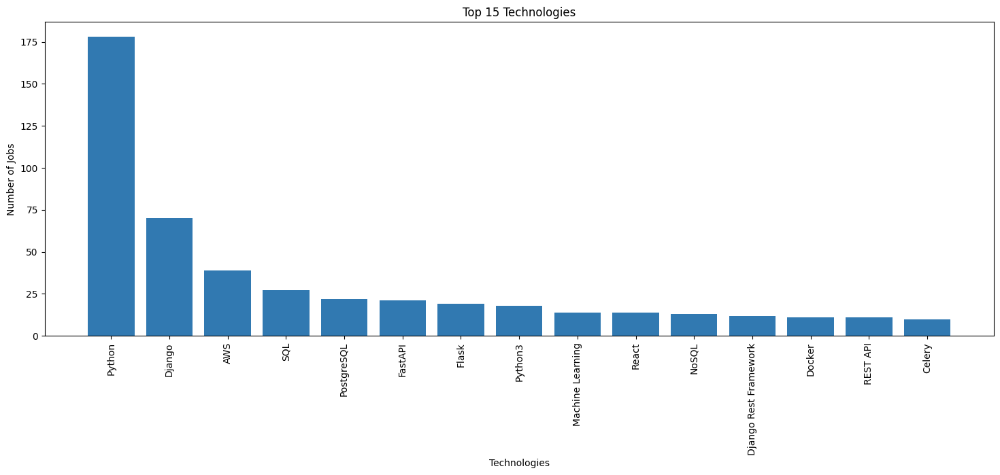

# Djinni Python technologies statistics

The project is a web scraper that extracts job 
information from the website "https://djinni.co/jobs/" 
and generates several data analyses based on the job 
listings using pandas library in Jupyter Notebook.

The script scrapes the job listings' titles, 
companies, salaries, technologies, and locations. 
The data is then cleaned and transformed into a 
structured dataframe. The dataframe is then used 
to create data visualizations to analyze the top 
job technologies, job locations, and number of jobs 
per company.

```shell
git clone https://github.com/MaybeTI/Djinni-Python-technologies-statistics.git
python -m venv venv
venv\Scripts\activate (on Windows)
source venv/bin/activate (on macOS)
pip install -r requirements.txt
python parser.py
jupyter notebook
```
# Top 15 Technologies

# Top 10 Job Locations

# Number of Jobs per Company

# Average Salary by Country
